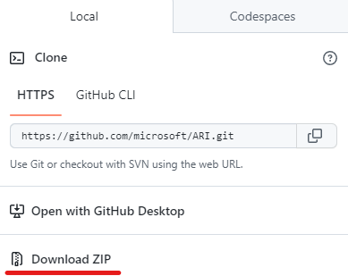
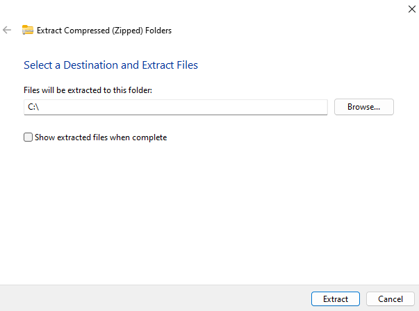
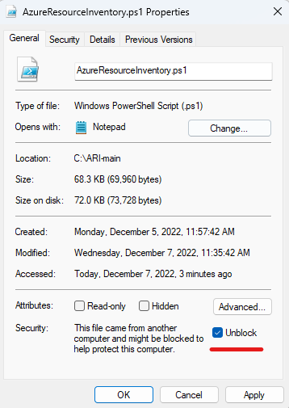
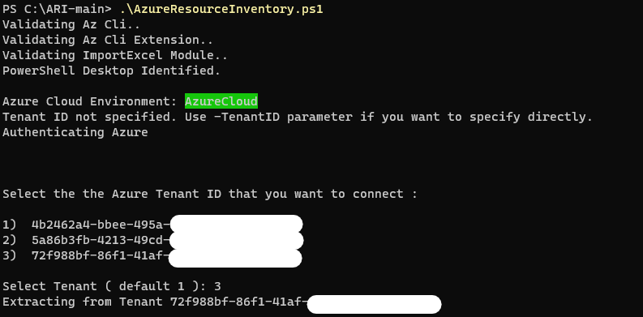
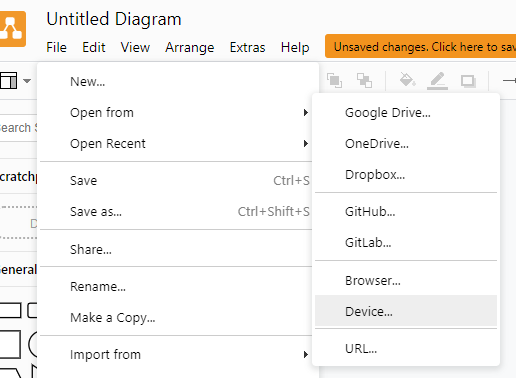

# How to run Azure Resource Inventory

<br/>

## Installing prerequisites
---------------------

<br/>

By running the script with administrative rights, it should be able to install all the prerequisites and runs smoothly, but if you prefers we can run the following commands just to make sure everything is set to run the script:

<br/>

1) Install Azure CLI:

<br/>

Download and install Azure CLI (https://learn.microsoft.com/en-us/cli/azure/install-azure-cli)

<br/>

2) Make sure the execution of scripts is allowed:

<br/>

```
Set-ExecutionPolicy -ExecutionPolicy Unrestricted
```

<br/>

3) Install Azure CLI Extensions:

<br/>

```
az extension add --name resource-graph
```

<br/>

4) Install Import-Excel Powershell Module:

<br/>

```
Install-Module -Name ImportExcel
```

<br/>

5) Download the Azure Resource Inventory Files:

<br/>



<br/>

6) Extract the Files:

<br/>



<br/>

7) Unblock the main file:

<br/>



<br/>

## Running the script
---------------------

<br/>

There are several parameters that can be used in the script, but just running the script without any parameter is enough to generate a standard Excel spreadsheet.

<br/>


<br/>

### Tenants
---------------------

<br/>

If you have permissions on more than one tenant, the script will prompt which Tenants do you want to run the inventory against:

<br/>



<br/>

If can also select which Tenant do you want to run the inventory against:

<br/>


<br/>

### Network Topology
---------------------

<br/>

To also create the Draw.io XML file of the environment topology is necessary to run the script with the "-Diagram" parameter:

<br/>


<br/>

This parameter will create an .XML file in the "C:\AzureResourceInventory" folder:

<br/>


<br/>

Now you just need to open draw.io and open the file:

<br/>



<br/>